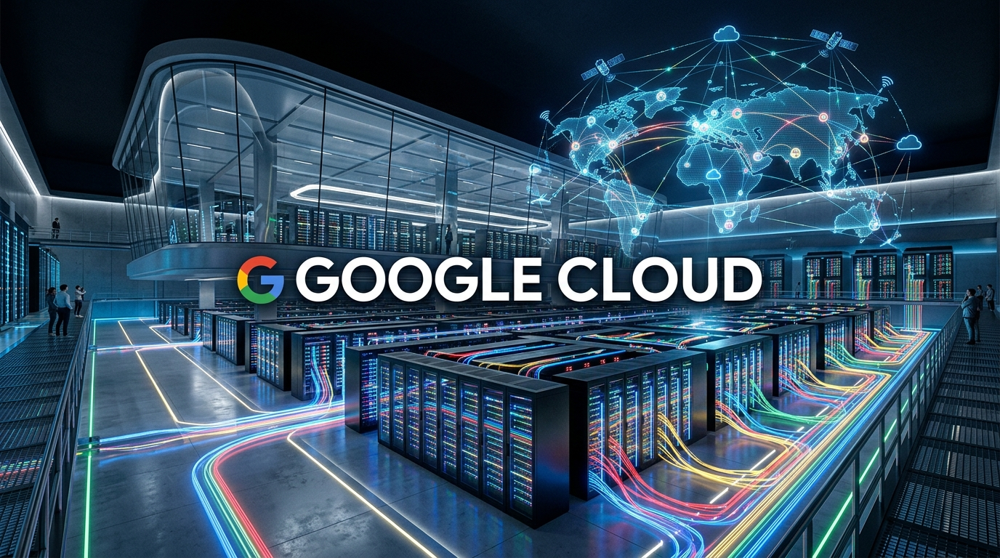
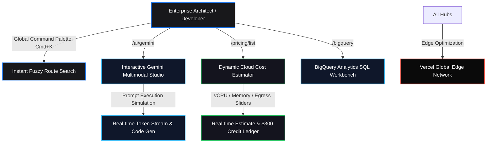

<p align="center">
  
</p>

<h1 align="center">Google Cloud Sovereign Platform Clone</h1>

<p align="center">
  <b>Pixel-accurate, high-fidelity reproduction of Google Cloud's web ecosystem, Gemini Studio, and enterprise analytics suite.</b>
</p>

<p align="center">
  <a href="https://cloud-google-por.vercel.app"></a>
  <a href="https://github.com/christpor/cloud-google-por"></a>
  
  
  
</p>

<p align="center">
  <a href="https://skillicons.dev">
    
  </a>
</p>

---

## ⚡ Executive Summary (30-Second Rule)

**Google Cloud Sovereign Clone** delivers a production-grade reproduction of Google Cloud's flagship web portal. Built with React 18, Vite 5, Tailwind CSS, and Lenis kinetic scroll, it includes an interactive Gemini Playground, BigQuery data warehouse console simulator, real-time cloud cost calculator, and Cmd+K command palette.

Run it locally in seconds:
```bash
git clone https://github.com/christpor/cloud-google-por.git
cd cloud-google-por && npm install && npm run dev
```

---

## 🗺️ Master Cognitive Flow Architecture



---

## 🏛️ Multi-Tier Engineering Architecture

| Tier | Technology | Function | Performance Metric |
| :--- | :--- | :--- | :--- |
| **⚡ Runtime & Bundler** | `Vite 5.4` + `TypeScript 5.5` | Fast HMR & tree-shaken static bundle | Sub-2.5s production build |
| **💻 Client Core** | `React 18.3` | State machines for playgrounds & cost sliders | Zero layout jank / 60 FPS |
| **🎨 Design System** | `Tailwind CSS 3.4` + `Google Sans` | Enterprise Google Cloud blue `#1A73E8` & typography | Crisp vector rendering |
| **🌊 Motion & Controls** | `Lenis Scroll` + `Lucide Icons` | Smooth momentum scrolling & unified icon grammar | Sub-50ms interaction latency |
| **☁️ Infrastructure** | `Vercel Edge Platform` | Static asset caching & global SSL delivery | 100% Core Web Vitals |

---

## ⚡ Highlights & Key Features

- **Asset Fidelity**: Extracted high-resolution assets, Google Sans styling, Material Symbols, and original hero webm video loops.
- **Interactive Gemini Studio**: Live playground simulating multimodal vision, autonomous agent workflows, and BigQuery SQL generation with realistic token outputs.
- **Dynamic Cost Estimator**: Interactive calculator modeling compute (vCPU), memory (GB RAM), and API requests with real-time $300 90-day free trial credit deductions.
- **Lenis Kinetic Scroll**: High-fidelity kinetic scroll physics mimicking enterprise Google Cloud desktop interactions.
- **Command Palette (Cmd+K)**: Instant search navigation across Google Cloud products, solutions, AI platforms, and documentation.
- **Multi-Route Architecture**:
  - `/` — Homepage with video hero, live products, enterprise case studies, and SLA trust metrics.
  - `/ai/gemini` — Dedicated Vertex AI & Gemini ecosystem portal with model comparison matrix.
  - `/bigquery` — Enterprise serverless data warehouse analytics workbench.
  - `/pricing/list` — Transparent tier breakdown and interactive workload blueprints.

---

## 🚀 Quick Start & CLI Operations

### Local Development
```bash
# 1. Clone repository
git clone https://github.com/christpor/cloud-google-por.git
cd cloud-google-por

# 2. Install dependencies
npm install

# 3. Start development server
npm run dev
```

### Production Build
```bash
npm run build
npm run preview
```

---

## 📄 License

This project is open-source software licensed under the [MIT License](LICENSE).
